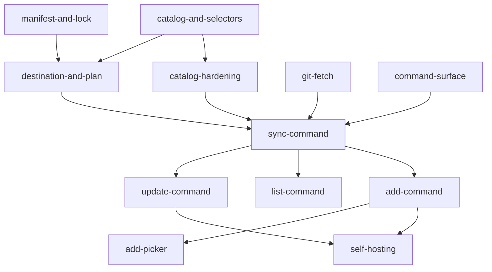

# Implementation Order

The roadmap from empty scaffold to a self-hosting `graft`. Each row is one OpenSpec change
with its own proposal, specs, design, tasks, and planning review.

**The roadmap is complete.** Every row below is archived, plus two changes it did not
anticipate — `catalog-hardening` and `semver-ranges` — and graft now vendors its own agents
and schema through its own `graft.toml`.

Read [SPEC.md](../SPEC.md) first — it is the contract every change below implements.

This is a plan, not a commitment. A change may split when its tasks turn out to carry two
kinds of work, or merge when a boundary proves imaginary. Update this file when that
happens rather than letting it drift.

## Phase 1 — File formats

Pure parsing and serialization. No filesystem beyond reading the files named, no network,
no writes to the working tree.

| Change | Delivers | Depends on |
|---|---|---|
| `manifest-and-lock` | `graft.toml` and `graft.lock` parsing, validation, and deterministic serialization. Byte-stable round-trip is the headline requirement. | — |
| `catalog-and-selectors` | `catalog.yaml` parsing, `kinds` and `provides`, and selector expansion including globs and the no-match error. | — |
| `catalog-hardening` | The four findings `catalog-and-selectors` deferred: one YAML document per catalog, `Load` refusing a path that is not a regular file, a version literal too wide to hold reported as a version, and destinations compared as paths. | `catalog-and-selectors` |

## Phase 2 — Planning

Still pure. `internal/plan` takes manifest, lock, and catalog and returns file operations
without touching anything.

| Change | Delivers | Depends on |
|---|---|---|
| `destination-and-plan` | Destination computation (`{name}`, `flatten`, list-valued `to`, consumer overrides), the prune set, and the invariants: no path escapes the repo root, no two items share a destination. | `manifest-and-lock`, `catalog-and-selectors` |

## Phase 3 — Sources

| Change | Delivers | Depends on |
|---|---|---|
| `git-fetch` | Rev resolution through `git ls-remote`, and the content-addressed fetch cache under `~/.cache/graft/`. A resolved sync works offline on a cache hit. | — |

## Phase 4 — The first end-to-end command

| Change | Delivers | Depends on |
|---|---|---|
| `command-surface` | Cobra, `--version`, help, exit codes, the stdout/stderr split, and `NO_COLOR` and non-TTY handling. Establishes the error format the failure-mode table specifies. | — |
| `sync-command` | `internal/apply` — the only writer — plus `graft sync` wired end to end. Files written, prune executed, empty directories removed, lock written last. | `destination-and-plan`, `git-fetch`, `command-surface` |

## Phase 5 — The rest of the surface

| Change | Delivers | Depends on |
|---|---|---|
| `update-command` | `graft update` and `graft update --to`, re-resolving pins and reporting what moved. | `sync-command` |
| `list-command` | `graft list`, and the `--json` output contract. | `sync-command` |
| `add-command` | ✅ `graft add` non-interactive: selectors as arguments, `--list`, `--no-sync`, manifest amendment. | `sync-command` |
| `add-picker` | ✅ The interactive multi-select, the `kind:*` collapse offer, and the no-TTY error. Chooses selectors and nothing else. | `add-command` |

## Phase 6 — Self-hosting

| Change | Delivers | Depends on |
|---|---|---|
| `self-hosting` | ✅ `graft.toml` replaces the hand-copied `openspec/schemas/tdd/` and `.claude/agents/`. The dogfood CI job it was to activate was dropped instead — the source is private and CI cannot read it. | `add-command`, `update-command` |

## Dependencies

## Notes on the ordering

**`sync` before `add`.** `add` is a convenience that writes a manifest and calls sync;
building it first would mean testing it against a sync that does not exist.

**`command-surface` has no dependencies and can go early.** It is worth doing before
`sync-command` so the first real command lands into a settled error format rather than
retrofitting one across four commands later.

**`catalog-hardening` is not optional before `sync-command`.** It was not planned here —
it exists because `catalog-and-selectors`' review deferred four findings on the grounds that
nothing read a real `catalog.yaml` yet. `sync-command` is where that stops being true, and
two of the four fail silently: a dropped YAML document and a doubled destination both
report success. Closing them afterwards would mean shipping a command that can under-install
without saying so.

**`git-fetch` is independent of the pure phases** and can be built in parallel with them if
two changes are ever in flight at once.

**`self-hosting` is last and is the real acceptance test.** Until this repo installs its own
schema and agents through graft, nothing has proven the tool works on the problem it was
built for.
